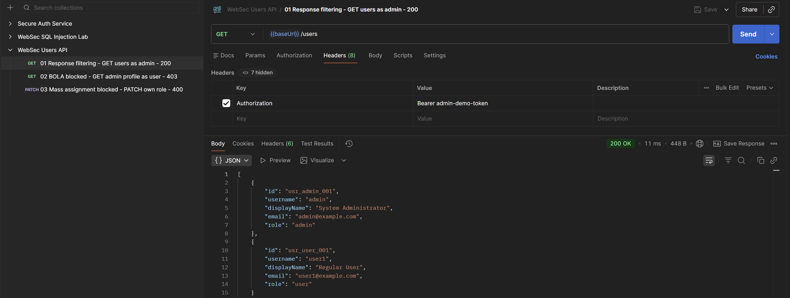
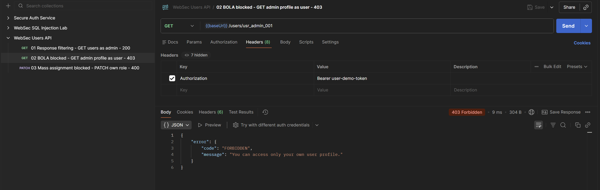
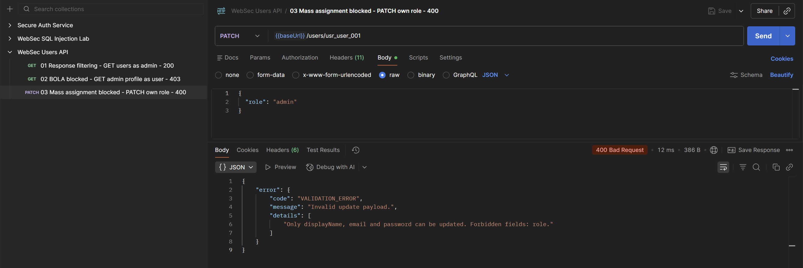

# WebSec Users API

**WebSec Users API** — учебный security lab на **Node.js + Express** про безопасное управление пользовательскими данными и контроль доступа в REST API.

Проект сфокусирован на типичных API Security ошибках: раскрытии внутренних полей, доступе к чужим объектам, недостаточной авторизации и mass assignment.

> Это учебный security lab, а не production-ready identity service.

## Что демонстрирует проект

- Bearer token authentication для демонстрационного API;
- role-based authorization для `admin` и `user`;
- owner-based access control: пользователь работает только со своим профилем;
- response filtering: наружу не уходят `passwordHash`, token, internal notes и database ID;
- allowlist обновляемых полей;
- защита от mass assignment и попытки повысить роль через request body;
- единый JSON-формат ошибок;
- OpenAPI, Postman, automated tests и GitHub Actions CI.

## Стек

- Node.js
- Express
- JavaScript
- Node.js Test Runner
- OpenAPI
- Postman
- GitHub Actions

## Структура

```text
websec-users-api/
├── src/
│   ├── routes/
│   ├── middleware/
│   ├── services/
│   ├── data/
│   └── utils/
├── tests/
├── docs/
├── postman/
├── .github/workflows/ci.yml
├── .env.example
├── package.json
└── README.md
```

## Локальный запуск

Используйте Node.js 22 (минимум 18). Проверьте `node --version`.

Команды выполняются из корня репозитория. В PowerShell файл окружения
можно скопировать командой `Copy-Item .env.example .env`.

```bash
git clone https://github.com/nikamurkaa/websec-users-api.git
cd websec-users-api
npm ci
cp .env.example .env
node --env-file=.env src/server.js
```

Команда выше рассчитана на Node.js 22 и явно загружает `.env`.
`npm start` использует только переменные процесса и встроенные значения;
сам по себе файл `.env` этот скрипт не читает.

API по умолчанию:

```text
http://localhost:3000
```

Остановка сервера — `Ctrl+C`.

Пример `.env`:

```env
PORT=3000
ADMIN_TOKEN=admin-demo-token
USER_TOKEN=user-demo-token
```

Эти токены являются только локальными демонстрационными значениями.

## Основные endpoint'ы

| Метод | Endpoint | Доступ |
| --- | --- | --- |
| `GET` | `/health` | Public |
| `GET` | `/users/me` | Authenticated user |
| `GET` | `/users` | Admin |
| `GET` | `/users/:id` | Owner или admin |
| `PATCH` | `/users/:id` | Owner или admin с ограничением полей |

Разрешённые поля обновления:

- `displayName`;
- `email`;
- `password`.

Передача `role`, внутренних ID и других запрещённых полей отклоняется.

## Security model

| Риск | Защита |
| --- | --- |
| Sensitive data exposure | public DTO / response filtering |
| Broken object authorization | owner check + admin override |
| Excessive privileges | RBAC |
| Mass assignment | allowlist полей PATCH |
| Непредсказуемые ошибки | единый JSON error handler |

Подробнее: [`docs/security-model.md`](docs/security-model.md).

## Демонстрация security controls

### Фильтрация чувствительных данных

API возвращает только публичные данные пользователя. В response отсутствуют внутренние поля, включая password hash, token, internal notes и database ID.



### Object-level access control

Обычный пользователь не может получить профиль другого пользователя. Попытка доступа к чужому объекту отклоняется с `403 Forbidden`.



### Защита от mass assignment

Попытка изменить защищённое поле `role` через обычный `PATCH` отклоняется allowlist-валидацией.



## Проверка

```bash
npm test
npm run check
```

Ручные сценарии: [`docs/manual-checks.md`](docs/manual-checks.md).  
OpenAPI: [`docs/openapi.yaml`](docs/openapi.yaml).  
Postman: [`postman/`](postman/).

## Статус

Проект завершён как учебный lab по **API authorization, object-level access control и защите пользовательских данных**.

## Автор

[Николь Журбенко](https://github.com/nikamurkaa)
